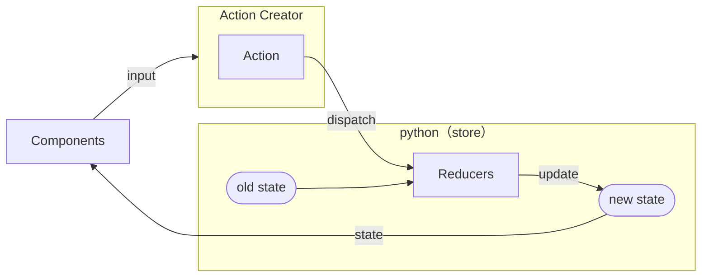

# py_webview

## state management

Redux Data Flow



## wry in rust vs pywebview in python

||rust|python|note|
|:--|:--                   |:--                 |:--|
|   |window.ipc.postMessage| -                  | in wry/Electron |
|   | -                    |window.pywebview.api| in pywebview    |

```javascript

// for pywebview
const res = window.pywebview.api.postMessage({ 'foo' : 'bar' })

// for wry
async function postMessage(obj){
  function handler(e) {
    window.removeEventListener('customEvent', handler);
    resolve(e.detail);
  }
  window.addEventListener('customEvent', handler, false);
  window.ipc.postMessage(JSON.stringify(obj));
}

// for wry
async function postMessage(obj){
  await fetch("http://wry.localhost/", {
    method: "POST",
    body: JSON.stringify(obj),
  });
}

```